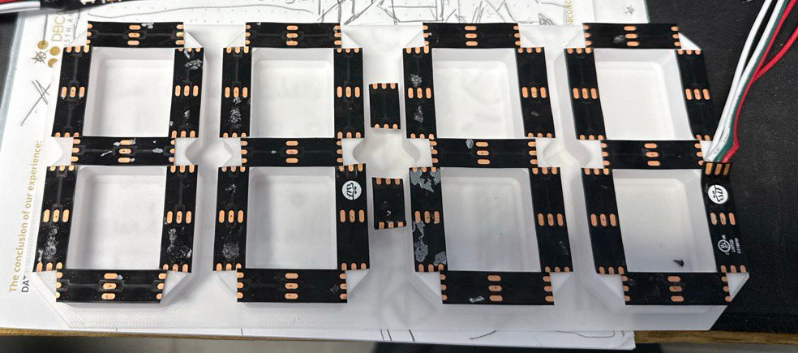
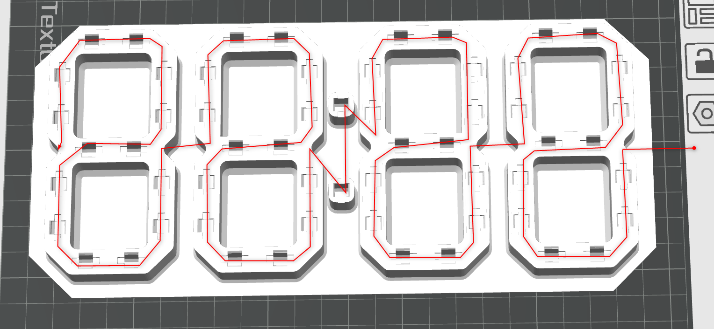
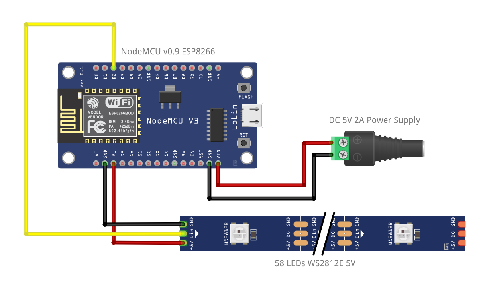
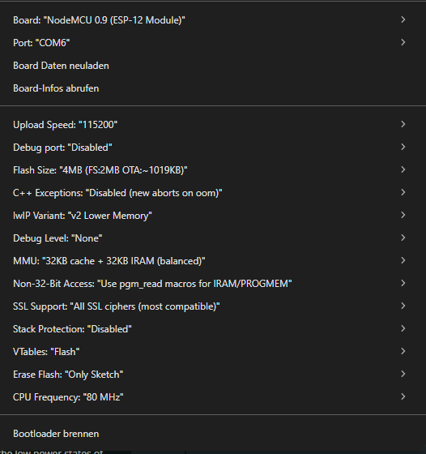
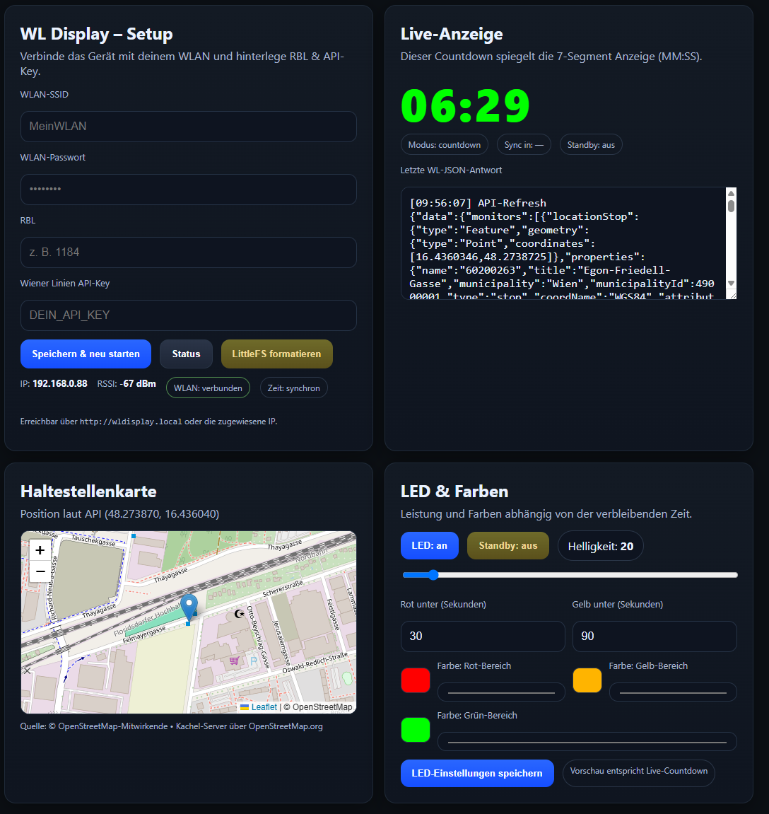
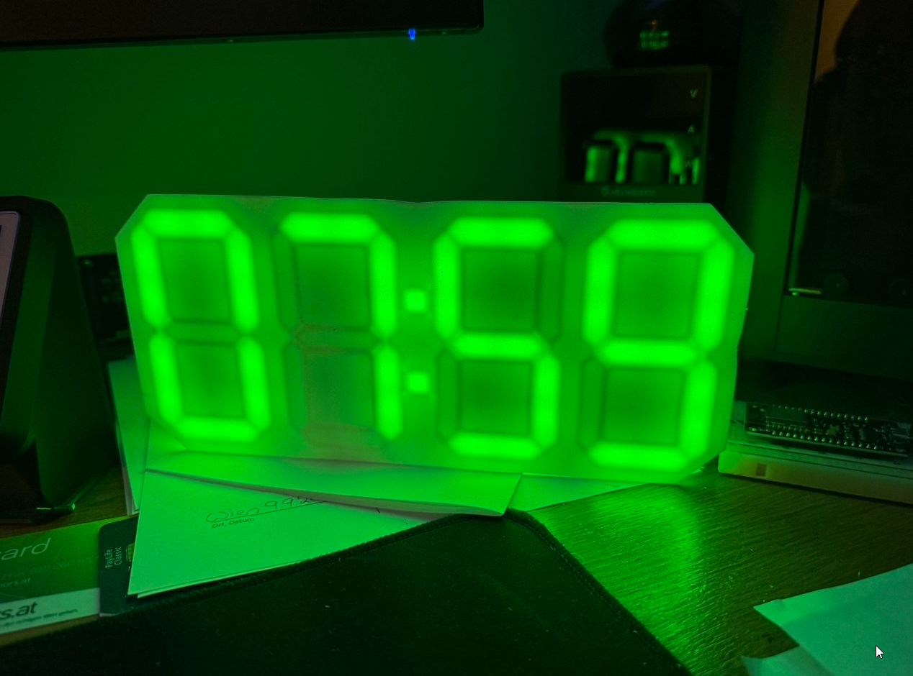

# 🚏 Wiener Linien Countdown Display

Dieses Projekt realisiert eine **4-stellige LED-Uhr mit NeoPixel 7-Segment Anzeige**, die  
über WLAN die **Echtzeit-Abfahrten der Wiener Linien (OGD-API)** abruft und als **Countdown** anzeigt.  

Neben der Anzeige verfügt das Projekt über ein **Webinterface**, flexible Konfiguration, OTA-Updates  
sowie eine **REST-API** zur Steuerung.

---

## ✨ Features

- Anzeige der Abfahrtszeit als Countdown (MM:SS)  
- Farben abhängig von verbleibender Zeit (Grün / Gelb / Rot)  
- 4-stelliges 7-Segment Display mit Doppelpunkt (58 LEDs gesamt)  
- Webinterface mit:
  - WLAN & API-Key Setup
  - Konfigurationsmöglichkeiten der LED-Farben, dessen Schwellwerte und Helligkeit
  - Standby-Modus/LED on/off
  - Live-Countdown + API-Log
  - OpenStreetMap-Karte der Haltestelle
- REST-API (siehe unten)  
- Konfigurationsspeicherung auf LittleFS

---

## 🛠️ Benötigte Hardware

- [Wemos D1 Mini (ESP8266)](https://www.amazon.de/dp/B06Y1ZPNMS)
- [NeoPixel-LED Streifen, 60 LEDs/m](https://www.amazon.de/dp/B09N9BJMZB) – mindestens 58 LEDs benötigt  
- 5V Netzteil (≥ 2A) – [Beispiel](https://www.amazon.de/dp/B078Q2ZMPT)  
- Kabel, evtl. Breadboard oder Lötleisten zm testen
- 3D-Drucker + Filament ;-)  

---

## 🧑‍🏫 Tutorial

### 1. Hardware Setup

1. Trägerplatte mit dem 3D-Drucker herstellen, du findest sie [auf Makerworld unter 892517](https://makerworld.com/de/models/892517-7-segment-clock-for-led-strips) 
2. NeoPixel Segmente zuschneiden und zu 4 Ziffern + Doppelpunkt zusammenfügen  
3. LEDs auf Trägerplatte kleben

4. Verdrahtung herstellen


5. Wemos D1 Mini verbinden:

   - **D2 (GPIO4)** → Data-In NeoPixel  
   - **5V** → VCC Strip  
   - **GND** → GND Strip  
   - Optional: 330 Ω Widerstand in Datenleitung  
   - Optional: 1000 µF Elko zwischen 5V und GND




---

### 2. Software Setup

1. **Arduino IDE installieren** → [Download](https://www.arduino.cc/en/software)  
2. ESP8266 Board Paket hinzufügen:  
   `http://arduino.esp8266.com/stable/package_esp8266com_index.json`  
3. ggf. Bibliotheken manuell installieren (bei mir wurden sie über die neue Arduino-IDE (2.3.6) selbstständig installiert):
   - `Adafruit NeoPixel`
   - `ArduinoJson`
   - `ESP8266WiFi`, `ESP8266WebServer`, `ArduinoOTA`, `ESP8266mDNS`
   - `LittleFS`

---

### 3. Erstes Testen

Zum Testen der Verdrahtung:  
- Sketch `led_check.ino` flashen  
- Alle LEDs laufen nacheinander in Rot, Grün, Blau und Weiß durch  
- So kannst du defekte oder falsch angeschlossene LEDs ausschließen

---

### 4. Firmware Flashen

- Sketch `wl7segment.ino` flashen  
- Folgende Einstellungen in der Arduino-IDE verwenden


---

### 5. Konfiguration

Beim ersten Start:  
- ESP startet im Setup-Modus → WLAN „**WienerLinienDisplaySetup**“ verbinden  
- Passwort: `12345678`  
- Browser öffnen: [http://192.168.4.1](http://192.168.4.1/) oder [http://wldisplay.local](http://wldisplay.local)
- SSID, Passwort, RBL-Nummer (Haltestellen-ID) und API-Key der Wiener Linien eingeben  

Im normalen Betrieb:  
- Zugriff über vergebene IP oder [http://wldisplay.local](http://wldisplay.local)  

Einstellungen im Webinterface:  
- **LED-Farben & Schwellwerte** (z. B. Rot < 2min)  
- **Helligkeit** (0–255)  
- **Standby-Modus** (Display AUS, Polling pausiert)



---

### 🌐 REST-API

Die Firmware bietet eine REST-Schnittstelle:

| Endpoint             | Methode | Beschreibung                                 |
|----------------------|---------|---------------------------------------------|
| `/api/status`        | GET     | Status (IP, RSSI, Countdown etc.)           |
| `/api/config`        | POST    | WLAN + API Config speichern                  |
| `/api/led`           | POST    | LED-Einstellungen (Helligkeit, Farben)       |
| `/api/display`       | POST    | Anzeige-Modus (countdown, off, minus, standby) |
| `/api/standby`       | POST    | Standby ein/aus                              |
| `/api/fetch-now`     | POST    | Sofort neue API-Abfrage                      |
| `/api/fs-format`     | POST    | LittleFS formatieren                         |
| `/api/last-payload`  | GET     | Letzte Rohantwort der Wiener Linien API      |

### 📡 REST-API Beispiele

Alle POST-Endpunkte erwarten **JSON** im Request-Body.  
Die Antworten kommen ebenfalls als JSON zurück.

## 🔧 /api/config  
Speichert WLAN- und API-Einstellungen im LittleFS.

```bash
curl -X POST http://wldisplay.local/api/config   -H "Content-Type: application/json"   -d '{
    "ssid": "MeinWLAN",
    "password": "WLAN_PASSWORT",
    "rbl": "1184",
    "apikey": "DEIN_API_KEY"
  }'
```

---

## 💡 /api/led  
Stellt Helligkeit und Farben ein.  
Farben im RGB-Format (`0–255`).

```bash
curl -X POST http://wldisplay.local/api/led   -H "Content-Type: application/json"   -d '{
    "brightness": 150,
    "color_green": [0,255,0],
    "color_yellow": [255,255,0],
    "color_red": [255,0,0]
  }'
```

---

## 🖥️ /api/display  
Ändert den Anzeigemodus.

Mögliche Werte:  
- `countdown` → normaler Countdown  
- `off` → Display komplett aus  
- `minus` → zeigt `--` (Fehler/kein Signal)  
- `standby` → LEDs aus, Polling pausiert  

```bash
curl -X POST http://wldisplay.local/api/display   -H "Content-Type: application/json"   -d '{"mode": "standby"}'
```

---

## 🛑 /api/standby  
Einfacher Shortcut, um Standby ein- oder auszuschalten.

```bash
curl -X POST http://wldisplay.local/api/standby   -H "Content-Type: application/json"   -d '{"enabled": true}'
```

---

## 🔄 /api/fetch-now  
Erzwingt sofort eine neue API-Abfrage.

```bash
curl -X POST http://wldisplay.local/api/fetch-now
```

---

## 🔄 /api/status  
Liefert den aktuellen Status der Anzeige.

```bash
curl http://wldisplay.local/api/status
```

JSON-Antwort:
```
{
  "ip": "192.168.0.88",
  "rssi": -60,
  "lastDisplay": "00:31",
  "secondsToBus": 0,
  "lastUpdateMs": 24657563,
  "timeSynced": true,
  "now": 1759390697,
  "standby": true,
  "ledPower": true,
  "brightness": 20,
  "currentColor": [255, 180, 0],
  "thresholds": {
    "low": 30,
    "mid": 90
  },
  "colors": {
    "low": [255, 0, 0],
    "mid": [255, 180, 0],
    "high": [0, 255, 0]
  },
  "coords": {
    "lat": 48.27387,
    "lon": 16.43604
  },
  "mode": "standby",
  "ssid": "49er_5G",
  "apiKey": "xxxxxxxxx",
  "rbl": "1184",
  "httpsInsecure": false,
  "httpsFingerprint": "",
  "loglen": 6000
}
```

---

### 📸 Fertige Anzeige:  



---

### ✅ Zusammenfassung

- LEDs verkabeln  
- Mit `led_check.ino` testen  
- Mit `wl_7_segment.ino` + LittleFS flashen  
- Im Setup-WLAN konfigurieren  
- Countdown genießen 🚏
